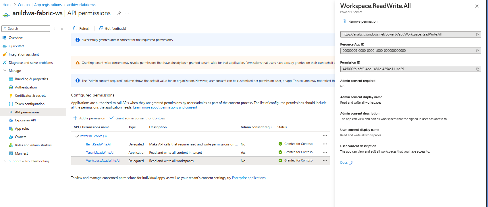
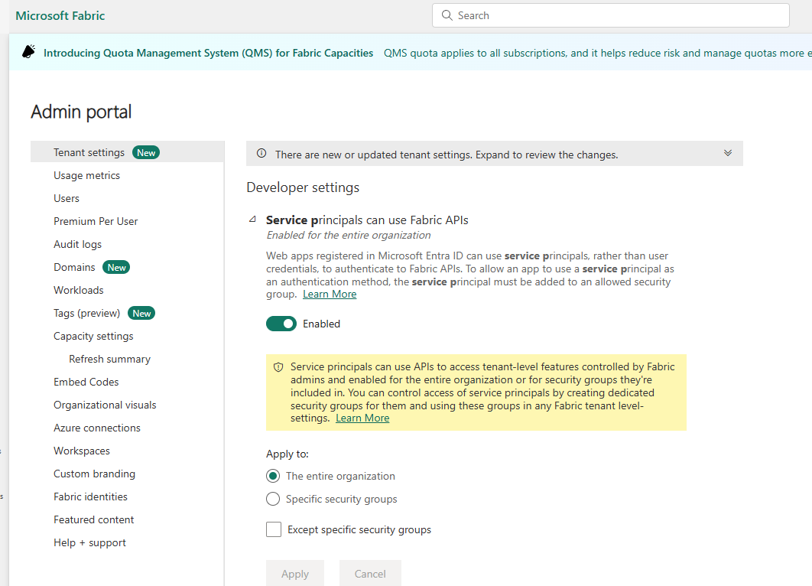
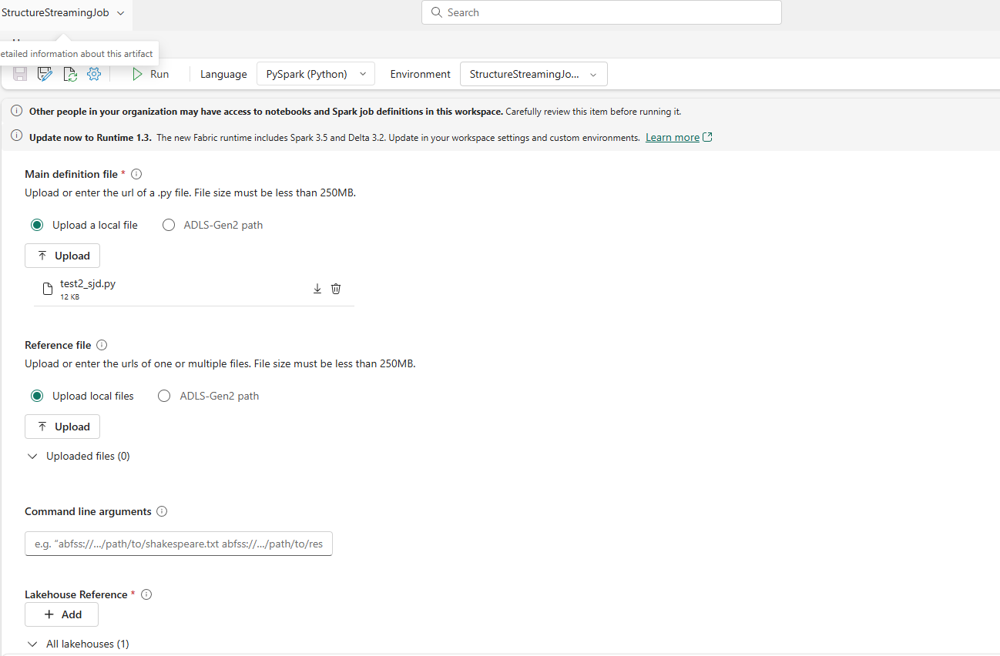

## Running Spark Structured Streaming in Microsoft Fabric

This repository contains a sample notebook and a sample python script that demonstrates how to run Spark Structured Streaming in Microsoft Fabric. The notebook or the python script is designed to be used with the Microsoft Fabric platform, which provides a unified analytics experience for data engineering, data science, and business intelligence.

This repo uses a sample schema mapped to the Catalog Sales and retrieves schema from Azure Schema Registry. The notebook or the script reads data from Azure Event Hub and processes it using Spark Structured Streaming. The processed data is then written to a target location as Delta Table in Microsoft Fabric. 
The delta table can be queried using SQL or used for further processing in Microsoft Fabric.

## Main Features
- **Structured Streaming**: This repo showcases how to use Spark Structured Streaming to process real-time data streams. Use either the a notebook or using a Spark Job definition to run the streaming job. 
- **Integration with Azure Event Hub and Schema Registry**: The sample demonstrates how to read data from Azure Event Hub and use the Azure Schema Registry for schema management.This uses Avro schema to read the data from Event Hub and write it to Delta Table.
- **Secretless Connection**: The notebook uses a secretless connection to Azure Event Hub, ensuring that sensitive information is not exposed in the code.
- **Batch Processing**: Either Data Pipelines or Spark Job Definitions can be used for batch processing or using the Spark UI for interactive processing.
- **Token Authentication**: [notebookutils](https://learn.microsoft.com/en-us/fabric/data-engineering/notebook-utilities) is used for token authentication to connect to Azure Key Vault to retrieve secrets to connect to Azure Event Hub and Azure Schema Registry. It uses Event Hub Connection String and Service Principal to connect to Azure Schema Registry.
- **Managed Vnet Integration**: The notebooks can connect to Azure Event Hub and Azure Schema Registry using Managed Vnet integration, ensuring secure and private connectivity to Azure services.

## Prerequisites
- Microsoft Fabric workspace with Spark pools.
- Azure Event Hub namespace and event hub instance.
- Azure Schema Registry instance.
- Azure Key Vault instance with secrets for Event Hub connection string and Schema Registry Service Principal secret.
- Service Principal with access to Azure Event Hub, Azure Schema Registry and Azure Key Vault.

### Permissions Required
- **Azure Event Hub**: The service principal must have the `Azure Event Hubs Data Receiver` role assigned to it for the Event Hub namespace.
- **Azure Schema Registry**: The service principal must have the `Schema Registry Contributor` role assigned to it for the Schema Registry instance.
- **Azure Key Vault**: The service principal must have the `Key Vault Secrets User` role assigned to it for the Key Vault instance.

### Fabric API Permissions

## Getting Started
1. Clone this repository to your local machine.
2. Create Fabric Spark Environment and upload the PublicLibrary.yml and publish the environment. This will install the required libraries for the notebook to run.
3. Make necessary data processing changes and upload the notebook to your Fabric workspace and attach it to the newly created Spark Environment. Use the provided PublicLibrary.yml and upload it to the environment. The environment uses the following libraries:
   - `fastavro==1.10.0` for Avro serialization and deserialization.
   - `azure-schemaregistry-avroencoder==1.0.0` for Azure Schema Registry client library.
4. Update the notebook with your Azure Event Hub, Schema Registry, and Key Vault details.
5. Create Service Principal Secret and Event Hub Connection string and add it to the Key Vault. 
6. Update Schema Registry details as needed in the notebook. 
7. Create a New Data Pipeline and add the notebook to the pipeline. and run the pipeline.
8. Alternatively, create a new Spark Job Definition and add the StreamingSparkJob.py to the job definition. and run the job.
9. Monitor the run and check logs and expected output in the target locations. 
10. You can run the provided TriggerSparkJob.ps1 powershell script to trigger the Spark Job using Microsoft Fabric REST APIs. 

